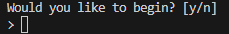
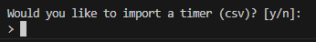
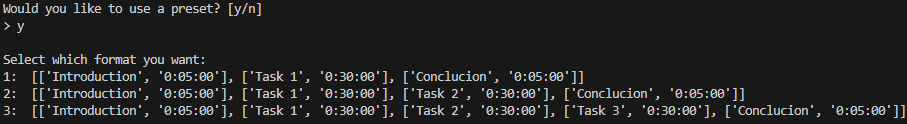
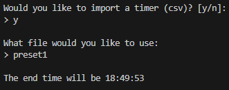
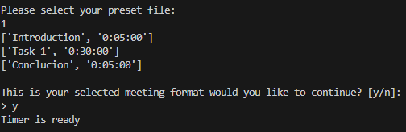
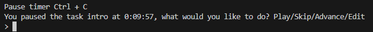
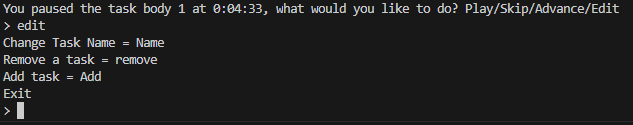
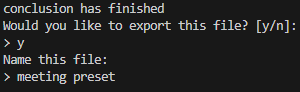

# Meetings timer
<p>User manual for the timer</p>

### Pre installation 
<p>Frist the user will need to have python installed on their computer to do so vist [here](https://www.python.org/)</p>
<p>Next the user will also need to install the sounds library. Which is done by opening the terminal or cmd and typing</p>

```
pip install playsound==1.2.2
```

## Getting started
<p>To start the program please find the [Driver.py] (assignment_1/Driver.py) file. Once in the driver file press run this will start the program.</p>
<p>You will be greeted with a message asking if you would like to being. please enter Y to being or N to exit the program.</p>

<p>Then you will be prompted to asking weather you would like to import a timer from a csv file.  Y to import or N to continue.</p>

<p>Next prompt will be to use a preset timer made by us. Y to use a preset timer or N to enter your own.</p>


### Importing a timer
<p>If you chose to import a timer you will be prompted which file you would like to import from, please enter the name of the file.</p>


### Chosing a preset
<p> The user will be presented with 3 options each option having a task name and the time. Enter 1, 2 or 3 to make a selection. </p>


### Making your own timers
<p> The frist step will be to enter all the task the user would like to do seprated by ",". Eg task 1, Task 2, task 3 </p>
<P> Then the program will go through each task asking for a time. time needs to be enter H:MM:SS. eg 0:30:00.
The program will display the current tasks that were entered. Press Y to contuine or N to add more tasks</p>


### Starting the timer
<p>Press enter to start the timer</p>
<p>To pause the timer and make adjustments press CTRL + C this will bring up a menu to Play which will start the timer, Skip which will start the next timer, advance which will allow the user to make changes to the time and Edit. Please make a selection by typing it out. </p>


#### Edit
<p> If edit is selected the user will be propmted with a few more options. Change name which allows the user to change the name of the tasks, Remove which allows the user to remove a task, add task and exit which start the timer. Please make a selction by typing it out</p>


### Finished timer
<p> Once the timer has finshed the user will be prompted to export the timer into a csv file. Please make a selction. The timer will ask for a name for a file.</p>
